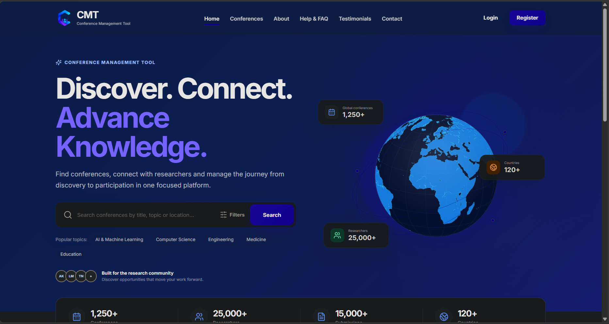

# CMT Frontend

## Conference Management Tool — Frontend

<div align="center">


&nbsp;&nbsp;

&nbsp;&nbsp;

&nbsp;&nbsp;


### Conference Management Tool

**Functional Frontend Demo • React • JavaScript • Tailwind CSS • Vite**


</div>

---

## 📌 Project Status

> ⚠️ **Functional Demo / Work in Progress**

This directory contains the **frontend application for the CMT (Conference Management Tool)**.

The frontend is being developed as a **functional project demo** that will continue to grow as the team implements, improves and integrates additional CMT features.

The frontend is **not a landing-page-only project**. It currently contains multiple functional pages, including the public-facing experience, authentication pages, conference-related pages and other screens being developed by the frontend team.

> **Important:** This is **not yet the final production version of CMT**.
>
> Pages and functionality are being added, improved and integrated continuously. Team members may push additional pages and features to the repository as they are completed.

---

# 📸 Current Frontend Preview

The frontend currently includes the **CMT public-facing experience** and multiple supporting pages.

## 🏠 Landing Page



> **Note:** This screenshot represents the current frontend demo. As development continues, the interface and functionality may change.

---

# 🎯 Purpose of the Frontend

The frontend provides the **user-facing interface** for the CMT system.

It is responsible for:

* **User interface**
* **Navigation**
* **Responsive design**
* **Forms**
* **User interactions**
* **Client-side validation**
* **Loading and error states**
* **Conference browsing**
* **Authentication interfaces**
* **User dashboards**
* **Role-based interfaces**
* **Communication with the backend API**

The frontend is being developed from the **requirements, workflows and wireframes** provided by the project teams.

The initial structure was based on the requirements and workflows provided by **Team A**, while the frontend team is responsible for implementing the working interface and continuously improving it as the project develops.

---

# 🖥️ Current Frontend

The frontend is now **more than a landing page**.

The current application includes or is being developed to include areas such as:

```text
CMT Frontend
│
├── Public Pages
│   ├── Home / Landing
│   ├── About
│   ├── Conferences
│   ├── Conference Details
│   ├── Help / FAQ
│   ├── Contact
│   └── Testimonials
│
├── Authentication
│   ├── Login
│   ├── Register
│   ├── Forgot Password
│   └── Reset Password
│
├── User Features
│   ├── My Conferences
│   ├── Submit Proposal
│   └── Proposal Status
│
├── Reviewer Features
│   └── Reviewer Dashboard
│
├── Organiser Features
│   ├── Organiser Dashboard
│   ├── Create Conference
│   ├── Edit Conference
│   ├── Manage Submissions
│   └── Programme Management
│
└── Reporting
    └── Reports / Statistics
```

---

# 🔌 Frontend & Backend Integration

The frontend is part of the **same CMT repository as the backend**.

The expected architecture is:

```text
┌─────────────────────────────┐
│          FRONTEND           │
│                             │
│     React + Tailwind        │
│     Pages + Components      │
└──────────────┬──────────────┘
               │
               │ API Requests
               ▼
┌─────────────────────────────┐
│           BACKEND           │
│                             │
│     Laravel / PHP           │
│     API + Business Logic    │
└──────────────┬──────────────┘
               │
               ▼
┌─────────────────────────────┐
│          DATABASE           │
└─────────────────────────────┘
```

The frontend should **not communicate directly with the database**.

Frontend features should communicate with the backend through the appropriate **API/service layer**.

---

# 🗂️ Frontend Service Layer

API communication should be kept **separate from UI components**.

For example:

```text
src/
├── components/
├── pages/
└── services/
    ├── conferenceService.js
    ├── authService.js
    ├── submissionService.js
    └── ...
```

This separation allows frontend developers to work on the interface while the backend team develops the corresponding API.

During development, **mock data may be used** where the backend endpoint is not yet available.

---

# 🛠️ Technology Stack

## Frontend

<div align="center">

| Technology                                                                                                                                          | Purpose                                |
| --------------------------------------------------------------------------------------------------------------------------------------------------- | -------------------------------------- |
|  **React**                           | Frontend UI and component architecture |
|  **JavaScript**       | Application logic                      |
|  **JSX / HTML5**                     | React components and page structure    |
|  **Tailwind CSS** | Utility-based styling                  |
|  **CSS**                                | Custom styling where required          |
|  **Vite**                           | Development server and build tooling   |

</div>

* **React** — frontend UI and component architecture
* **JavaScript** — application logic
* **JSX** — React components
* **Tailwind CSS** — utility-based styling
* **CSS** — custom styling where required
* **HTML5** — page structure
* **Vite** — development server and build tooling

---

## 🔧 Development & Collaboration Tools

<div align="center">


&nbsp;

&nbsp;

&nbsp;

&nbsp;

&nbsp;


</div>

* **Git**
* **GitHub**
* **GitHub Issues**
* **GitHub Pull Requests**
* **GitHub Projects**
* **VS Code**
* **Node.js**
* **npm**
* **Vite**
* **Browser Developer Tools**
* **Postman / API testing tools**

---

# 🤝 Working With the CMT Repository

The CMT frontend is part of the **main CMT repository**.

The repository structure is:

```text
CMT/
│
├── backend/
│
├── frontend/
│
└── README.md
```

Everyone should work from the **main CMT repository** so that the frontend and backend remain in one place.

Frontend changes should be made inside:

```text
frontend/
```

Backend changes should be made inside:

```text
backend/
```

> ❗ **Do not create a separate repository for individual frontend pages or features.**

---

# 🌿 Git Workflow

The frontend team should **not work directly on `main`**.

The current frontend development branch is:

```text
Frontend-setup
```

Developers can create their own feature branches from the latest appropriate branch when working on new features.

For example:

```text
main
 │
 └── Frontend-setup
       │
       ├── feature/about
       ├── feature/conferences
       ├── feature/authentication
       ├── feature/dashboard
       └── feature/reviewer
```

---

# 🚀 How to Start Working

## 1. Clone the Main CMT Repository

```bash
git clone <repository-url>
```

Move into the project:

```bash
cd CMT
```

---

## 2. Pull the Latest Changes

Before starting work:

```bash
git pull origin main
```

If the frontend team is currently working from `Frontend-setup`:

```bash
git checkout Frontend-setup
git pull origin Frontend-setup
```

> **Always make sure you are working from the latest version before starting a new feature.**

---

## 3. Move Into the Frontend Directory

```bash
cd frontend
```

Install dependencies:

```bash
npm install
```

---

## 4. Start the Frontend

```bash
npm run dev
```

Vite will provide the **local development URL** in the terminal.

---

# 🌱 Creating a Feature Branch

> 🚫 **Do not work directly on `main`.**

Create a branch for your feature:

```bash
git checkout -b feature/my-feature
```

Examples:

```text
feature/conferences
feature/about
feature/login
feature/register
feature/reviewer-dashboard
feature/organiser-dashboard
feature/my-conferences
feature/api-integration
```

Use **clear branch names** so everyone knows what is being developed.

---

# 💾 Commit Your Work

After making changes:

```bash
git status
```

Review your changes.

Then:

```bash
git add .
```

Commit with a clear message:

```bash
git commit -m "Add conference details page"
```

Avoid vague commit messages such as:

```text
update
changes
stuff
fix
test
```

Prefer descriptive messages such as:

```text
Add conference details page
Fix responsive conference filter
Connect login form to authentication API
Add organiser dashboard navigation
```

---

# ⬆️ Push Your Branch

Push your feature branch:

```bash
git push origin feature/my-feature
```

Then open a **Pull Request on GitHub**.

---

# 🔀 Pull Request Process

The expected workflow is:

```text
Pull latest changes
        ↓
Create feature branch
        ↓
Develop feature
        ↓
Test locally
        ↓
Commit
        ↓
Push branch
        ↓
Open Pull Request
        ↓
Code Review
        ↓
Approval
        ↓
Merge
```

> ⚠️ **Do not merge unfinished work simply because the page renders.**

The feature should be **tested before requesting review**.

---

# 🧪 Before Opening a Pull Request

Check:

* [ ] The page loads correctly.
* [ ] Navigation works.
* [ ] Buttons work.
* [ ] Forms work.
* [ ] Validation works.
* [ ] Loading states are handled.
* [ ] Empty states are handled.
* [ ] Error states are handled.
* [ ] Desktop layout works.
* [ ] Mobile layout works.
* [ ] No unnecessary console errors.
* [ ] Existing components have been reused where appropriate.
* [ ] No unrelated files were changed.
* [ ] The feature works with the current frontend version.

---

# 🎨 Frontend Development Guidelines

## ♻️ Reuse Existing Components

Before creating a new component, check whether an existing component can be reused.

For example:

```text
Navbar
Button
Card
SearchBar
SectionHeading
FormInput
Modal
```

The goal is to keep the **CMT interface consistent**.

---

## 📄 Keep Pages Independent

Developers should be able to work on different pages without constantly modifying each other's work.

For example:

```text
About.jsx
Conferences.jsx
Login.jsx
ReviewerDashboard.jsx
OrganiserDashboard.jsx
```

should remain **separate page-level features**.

> **Do not put unrelated functionality into `Home.jsx`.**

---

## 🔌 Keep API Logic Separate

Avoid putting API requests directly into every component.

Prefer:

```text
Component
    ↓
Service
    ↓
Backend API
```

This makes future backend integration easier.

---

# 📱 Responsive Design

Every frontend feature should be tested on:

| Device          |
| --------------- |
| 🖥️ **Desktop** |
| 💻 **Laptop**   |
| 📱 **Tablet**   |
| 📱 **Mobile**   |

A page is **not considered complete** simply because it works on a developer's desktop screen.

---

# 🔐 Authentication & Permissions

The frontend provides the user interface for:

* **Login**
* **Registration**
* **Password reset**
* **Account management**
* **Role-specific screens**

However, **security and permissions must be enforced by the backend**.

For example, hiding an organiser button in React does not prevent an unauthorised API request.

The **Laravel backend must perform the actual permission checks**.

---

# 🔄 Continuous Development

The frontend is **actively being developed**.

Other developers may push new pages and features at any time.

Therefore:

* **Always pull the latest changes before starting new work.**
* Do not assume that your local copy represents the latest version of the frontend.

A page may have been:

* **Added**
* **Updated**
* **Refactored**
* **Connected to an API**
* **Replaced**
* **Moved**
* **Fixed for mobile**
* **Integrated with another feature**

since your last pull.

---

# 🚧 Project Status

## Functional Demo — Work in Progress

The current frontend is a **functional demonstration of the CMT system**.

It is no longer limited to the landing page.

The application already contains **multiple pages and features**, while other pages and integrations continue to be developed.

The frontend should therefore be viewed as:

```text
Functional Demo
      +
Continuous Development
      +
Backend Integration
      +
Future Improvements
```

It is **not yet the final production CMT application**.

The UI, functionality, API integration and page structure may continue to change as the team progresses.

---

# 📁 Recommended Frontend Directory

The frontend directory should look approximately like:

```text
frontend/
│
├── docs/
│   └── landing-page.png
│
├── public/
│
├── src/
│   ├── components/
│   ├── data/
│   ├── pages/
│   ├── services/
│   ├── App.jsx
│   └── main.jsx
│
├── package.json
├── vite.config.js
└── README.md
```

The exact contents may change as development continues.

---

# 👥 Frontend Team Principles

We are building **one frontend together, not separate projects**.

Everyone should:

* **Pull the latest version before starting.**
* **Work from the agreed CMT repository.**
* **Use feature branches.**
* **Keep frontend changes inside `frontend/`.**
* **Reuse existing components.**
* **Avoid breaking other pages.**
* **Test responsive behaviour.**
* **Commit clear changes.**
* **Push their branch.**
* **Open a Pull Request.**
* **Communicate when a change affects another developer.**
* **Keep the frontend ready for backend integration.**

---

# 🎯 Goal

The goal of this frontend directory is to create a **clean, maintainable and continuously evolving CMT frontend** that can be developed by multiple team members and integrated with the Laravel backend.

The landing page is **one part of the application**. The frontend is now a broader functional demo containing multiple pages, while additional functionality and integrations continue to be developed.

> **Build separately. Reuse components. Pull often. Communicate changes. Test before pushing. Review before merging.**

---

# 📚 Requirements Reference

The frontend implementation is guided by:

* **Team A requirements**
* **User workflows**
* **Initial wireframes**
* **CMT project requirements**
* **Relevant GitHub issues and tasks**
* **Backend API contracts when available**

The frontend should continue to evolve as the project requirements and implementation progress.

---

# ⚠️ Important

This README describes the **current frontend development direction and workflow**.

It does not mean that **every page, feature or API listed or discussed is complete**.

The CMT frontend is **under active development**.

New pages and functionality may be pushed to the repository at any time.

> 🔄 **Always pull the latest version before starting work.**

Current goal: build a **clean, reusable and functional frontend demo** that can progressively integrate with the Laravel backend and evolve into the final CMT product.

---

# ⚡ Quick Git Reference

```bash
# Clone the main repository
git clone <repository-url>

# Enter the project
cd CMT

# Get the latest main branch
git pull origin main

# Switch to the frontend development branch when required
git checkout Frontend-setup
git pull origin Frontend-setup

# Enter frontend
cd frontend

# Install dependencies
npm install

# Start frontend
npm run dev

# Create your feature branch
git checkout -b feature/my-feature

# Check your changes
git status

# Stage changes
git add .

# Commit
git commit -m "Describe the change"

# Push
git push origin feature/my-feature

# Open a Pull Request on GitHub
```

---

<div align="center">

### 🚀 CMT Frontend

**Functional Demo • Continuous Development • Backend Integration**


&nbsp;

&nbsp;

&nbsp;

&nbsp;


**Build separately. Reuse components. Pull often. Communicate changes. Test before pushing. Review before merging.**

</div>
